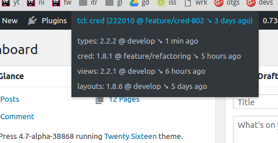

# tcl-status
WordPress plugins that shows information about Toolset plugin versions, branch names and the loaded Toolset Common Library 
instance in the admin bar.

Additionally, if the plugins are in a git repository, the plugin will show how long ago the branch was pulled from the origin.

The first item shows the information about the Toolset Comon library: 

>`tcl: ` *{from what plugin is the library loaded}* `(` *{$toolset_common_version}* `@` *{branch name}* `)`

The `$toolset_common_version` value is displayed only on recent branches where it is accessible from the outside.

Remaining items show active Toolset plugins, their version and branch. 
Following plugins are supported:

- Toolset Types
- Toolset Views
- Toolset CRED
- Toolset Layouts
- Toolset Access

## Installing
 - Clone or download the plugin into the `wp-content/plugins` directory in your site
   - `git clone https://github.com/zaantar/tcl-status.git`
 - Activate the plugin.
   - `wp plugin activate tcl-status`
   
## Extensions

It is possible to add further items by hooking into the `tcl_status_add_nodes` action.

### m2m

The "m2m" item displays the current state of the many-to-many relationship project (at the time when the admin menu is 
rendered, that means [during the `admin_bar_menu` action](https://codex.wordpress.org/Plugin_API/Action_Reference)).

Following tags can be present:

- `enabled`: Many-to-many relationships are enabled.
- `ready`: The support for many-to-many relationships is present but they're not enabled yet.
- `missing`: No support for many-to-many relationships.
- `full`: The m2m controller is fully loaded.
- `core`: Only the m2m controller's core is loaded, saving resources.
- `wpml-interop`: WPML interoperability with m2m associations is active.
- `refresh-needed`: Full refresh of the association translation table is (or will be) needed.

Tags in parentheses mean non-authoritative values (obtained through a workaround) that may not be reliable.